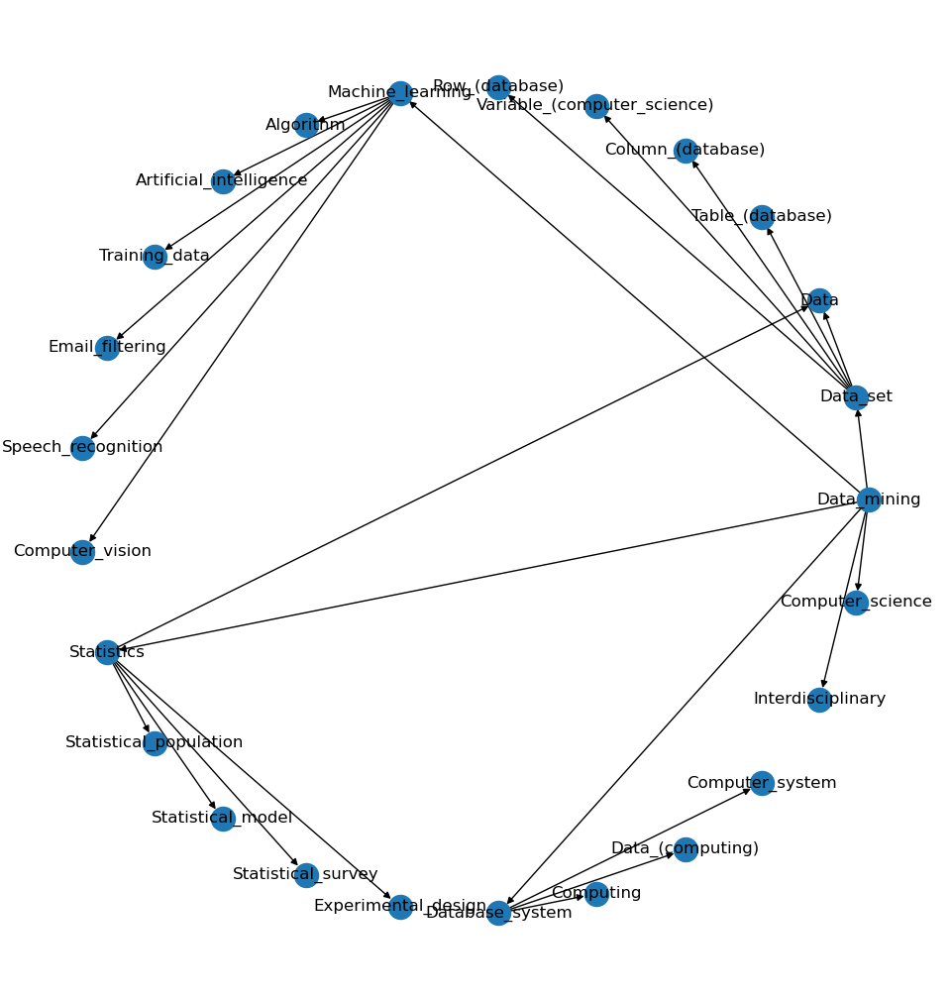
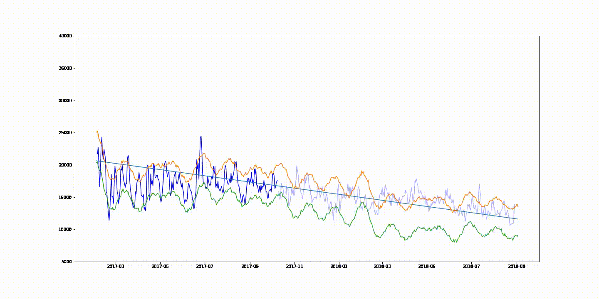

# About
This repo contains various analysis on different datasets. Current analysis 
focuses on time series forecasting and anomaly detection.

# Datasets
## Wikipedia
Drawing graph of page links.

```python
import urllib3
import networkx as nx
from wikipedia.parser import get_graph

pool = urllib3.PoolManager()

G = get_graph(pool, url = "https://en.wikipedia.org/wiki/Data_mining", deep=1)
nx.draw(G, nx.circular_layout(G), with_labels=True)
```


## E-commerce dataset from brazilian retail store

*Dataset - sampled daily*

*Prophet prediction of order volume with confidence intervals*

Notebooks:
- [Predictions with prophet](e_commerce/Prophet.ipynb)
- [Preparing data](e_commerce/e-commerce-anomaly-detection.ipynb)
- [Exploring data as time series](e_commerce/e-commerce-time-series.ipynb)
- [Frequent pattern mining with fpgrowth](e_commerce/e-commerce-frequent-pattern-mining.ipynb)
 
### Animations:

*Smoothed with 3-day moving average, yearly seasonality*
