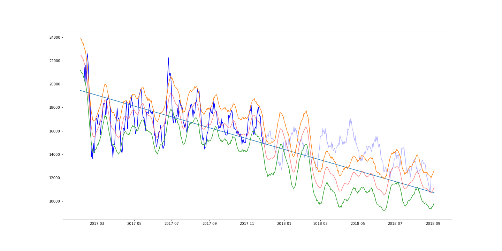
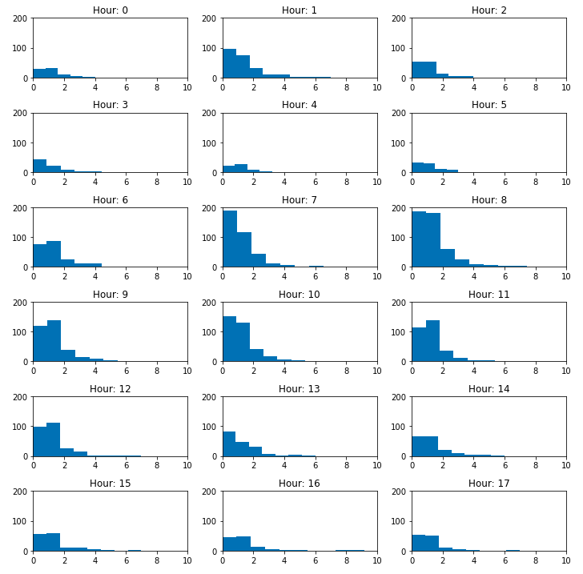

# About
This repo contains various analysis on different datasets. Current analysis 
focuses on time series forecasting and anomaly detection.

# Datasets
## Wikipedia
### Drawing graph of page links

```python
import urllib3
import networkx as nx
from wikipedia.parser import get_graph

pool = urllib3.PoolManager()

G = get_graph(pool, url = "https://en.wikipedia.org/wiki/Data_mining", deep=1)
nx.draw(G, nx.circular_layout(G), with_labels=True)
```


### Finding philosophy page

In this experiment, I'll test the hypothesis that:
**By going to the first link on any Wikipedia article, you'll end up on the  
[philosophy](https://en.wikipedia.org/wiki/Philosophy) article.** 

For more info on the subject go to my [dev.to article](https://dev.to/finloop/getting-to-philosophy-with-python-4nmc).

```python
crawl(pool, "https://en.wikipedia.org/wiki/Data_mining", phrase="Philosophy", deep=30, n=1, verbose=True)
```
    30 Entering Data_mining
    29 Entering Data_set
    
    ...

       [('https://en.wikipedia.org/wiki/Thought',
         [('https://en.wikipedia.org/wiki/Ideas',
           ['https://en.wikipedia.org/wiki/Philosophy'])])])])])])])])])])])])])])])])])])])])])])])])])])


[Experiment](wikipedia/README.md) and [code](wikipedia/wikipedia.ipynb)

## E-commerce dataset from brazilian retail store

*Dataset - sampled daily*

*Prophet prediction of order volume with confidence intervals*

Notebooks:
- [Predictions with prophet](e_commerce/Prophet.ipynb)
- [Preparing data](e_commerce/e-commerce-anomaly-detection.ipynb)
- [Exploring data as time series](e_commerce/e-commerce-time-series.ipynb)
- [Frequent pattern mining with fpgrowth](e_commerce/e-commerce-frequent-pattern-mining.ipynb)
 
### Animations:

*Smoothed with 3-day moving average, yearly seasonality*

## User interactions database

This dataset contains data from a news website. Each csv file contains info 
about sessions, clicks on articles, time of interaction etc. 

In file [frequency_analysis.ipynb](user_interactions/freqency_analysis.ipynb)
the distribution of page on with the article appears is analysed. For any
session I added the order of articles. Then I filtered for that one article and
created histograms for each hour.



## Image processing

Animation of how Sobel edge detetion works:
