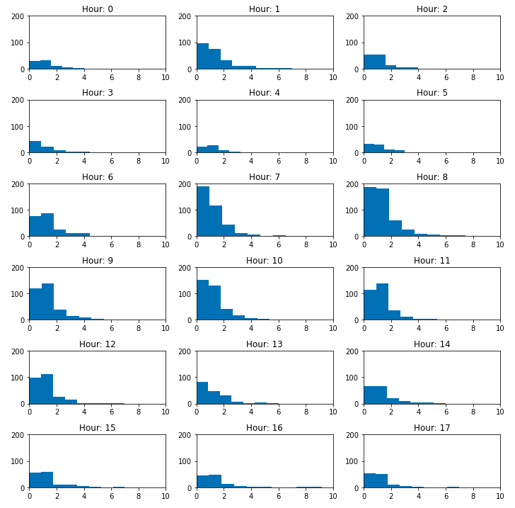

# User interactions dataset
This dataset contains data from a news website. Each csv file contains info 
about sessions, clicks on articles, time of interaction etc. 

In file [frequency_analysis.ipynb](freqency_analysis.ipynb) the distribution 
of page on with the article appears is analysed. For any session I added the 
order of articles. Then I filtered for that one article and created 
histograms for each hour. 

